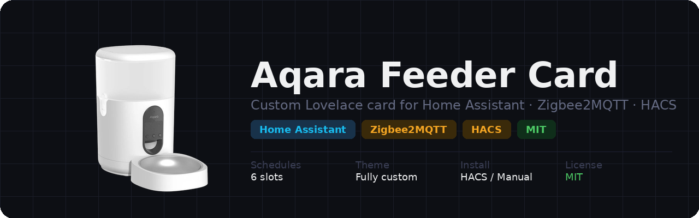
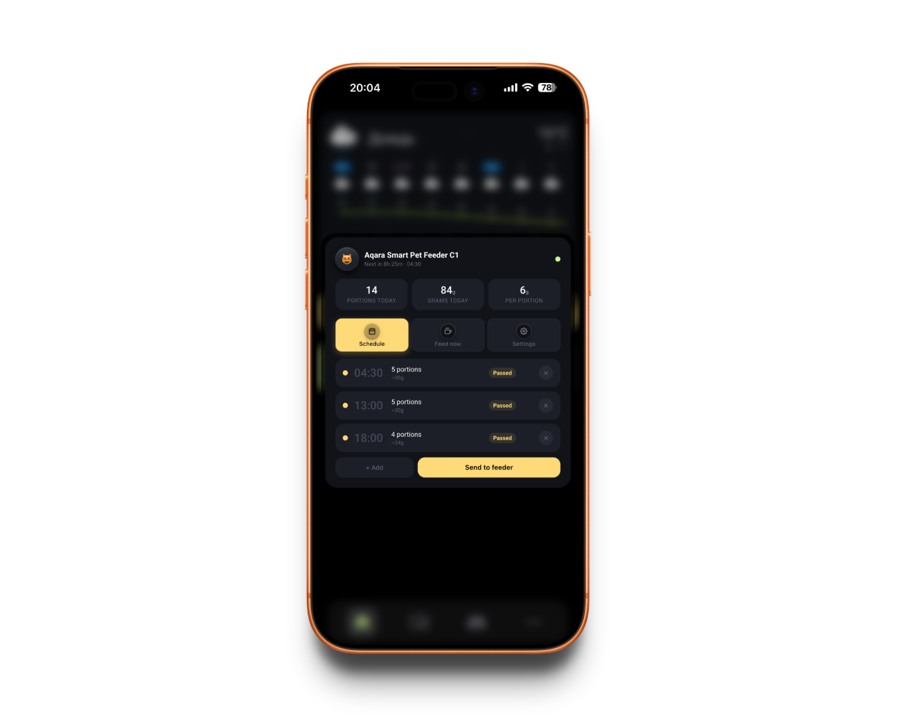
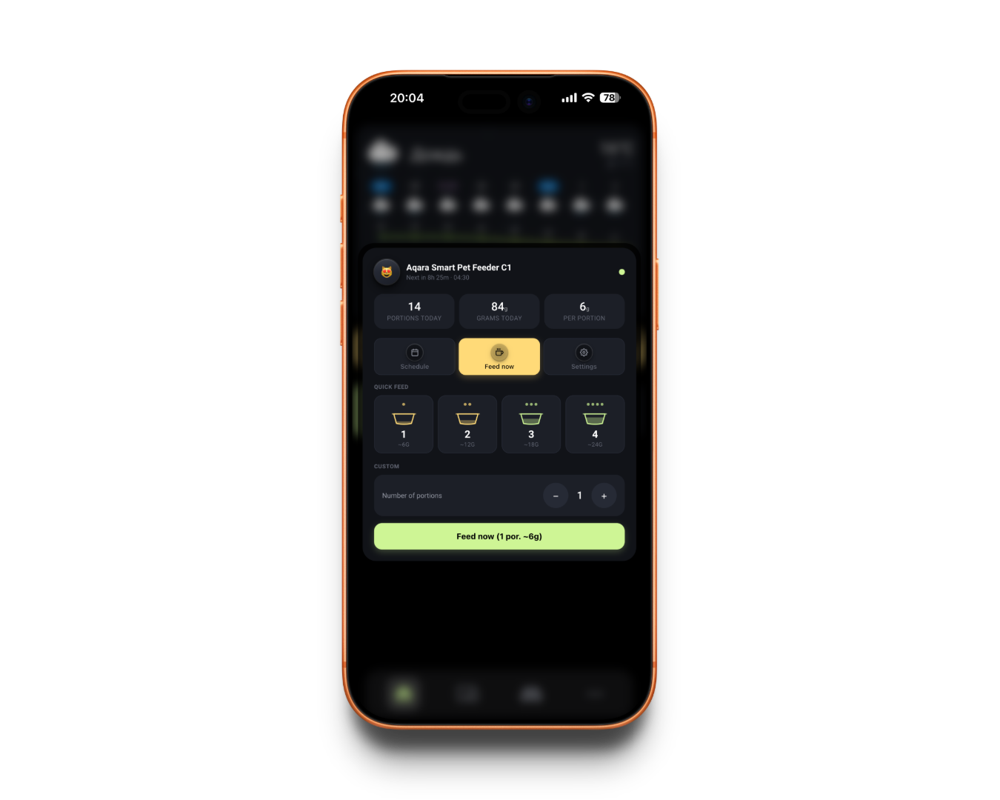
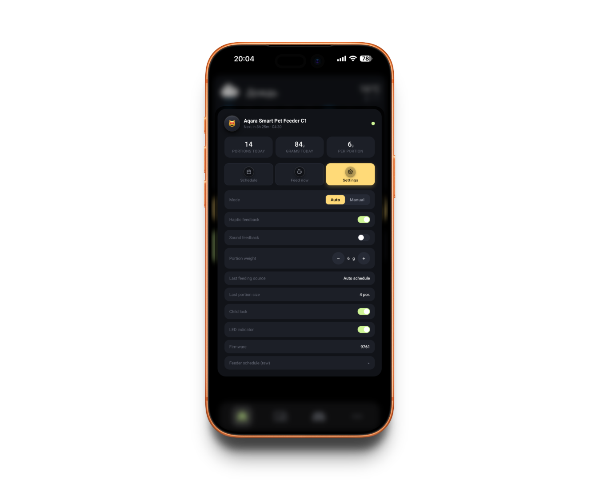

# Aqara Feeder Card

<p align="center">
  
</p>

<p align="center">
  A custom Lovelace card for <strong>Home Assistant</strong> to control an Aqara pet feeder (and compatible Zigbee feeders) via <a href="https://www.zigbee2mqtt.io/">Zigbee2MQTT</a>.
</p>

<p align="center">
  <a href="https://github.com/hacs/integration"></a>
  <a href="https://github.com/badbadtrip/aqara-feeder-card/releases"></a>
  <a href="https://github.com/badbadtrip/aqara-feeder-card/stargazers"></a>
  <a href="https://github.com/badbadtrip/aqara-feeder-card/issues"></a>
  <a href="LICENSE"></a>
</p>

---

<p align="center">
  <a href="#installation">Installation</a> &bull;
  <a href="#configuration-reference">Configuration</a> &bull;
  <a href="#️-required-template-sensors">Template sensors</a> &bull;
  <a href="#full-yaml-example">Full example</a> &bull;
  <a href="#troubleshooting">Troubleshooting</a> &bull;
  <a href="#contributing">Contributing</a>
</p>

---

## Features

- **Schedule tab** — view, add, edit and delete feeding schedules; send directly to the feeder via MQTT
- **Feed now tab** — quick 1–6 portion buttons + custom stepper with confirmation popup
- **Settings tab** — portion weight, child lock, LED indicator, operating mode, firmware version
- **Stats bar** — portions today, grams today, grams per portion
- **Full color theming** — 7 configurable colors (accents + backgrounds)
- **Custom labels** — all UI text is overridable
- **Haptic feedback** — optional vibration on mobile
- **Live status** — animated online/offline dot, error badge, schedule text in header
- **Visual config UI** — no YAML required

## Screenshots

<p align="center">
  
  
  
  
</p>

## Requirements

| Requirement | Details |
| --- | --- |
| Home Assistant | 2023.1 or newer |
| Zigbee2MQTT | Any recent version |
| MQTT integration | Configured in HA |
| Feeder | Aqara Pet Feeder C1 / E1 or compatible Zigbee feeder |

---

## Installation

<details>
<summary><b>Via HACS (recommended)</b></summary>

<br>

1. Open **HACS** → **Frontend**
2. Click the three-dot menu → **Custom repositories**
3. Enter URL: `https://github.com/badbadtrip/aqara-feeder-card`, Category: **Dashboard**
4. Click **Download**
5. Reload your browser

</details>

<details>
<summary><b>Manual</b></summary>

<br>

1. Copy `aqara-feeder-card.js` to `/config/www/`
2. Go to **Settings → Dashboards → Resources**
3. Add resource: URL `/local/aqara-feeder-card.js`, type: **JavaScript module**
4. Reload your browser

</details>

### Adding the card

In dashboard edit mode click **Add card** and search for **Aqara Feeder Card**.

Minimal YAML:

```yaml
type: custom:aqara-feeder-card
title: Feed the cat
icon: 🐱
topic: zigbee2mqtt/Feeder/set
```

---

## Configuration reference

<details>
<summary><b>General options</b></summary>

<br>

| Key | Type | Default | Description |
| --- | --- | --- | --- |
| `title` | string | `Feed the cat` | Card title |
| `icon` | string | `🐱` | Emoji or image path, e.g. `/local/images/cat.png` |
| `topic` | string | `zigbee2mqtt/Feeder/set` | MQTT set topic for your feeder |
| `max_schedules` | number | `6` | Maximum number of schedule slots |
| `vibration_enabled` | boolean | `true` | Haptic feedback on mobile |

</details>

<details>
<summary><b>Labels (all optional)</b></summary>

<br>

| Key | Default |
| --- | --- |
| `label_schedule` | `Schedule` |
| `label_feed` | `Feed now` |
| `label_settings` | `Settings` |
| `label_portions_today` | `Portions today` |
| `label_grams_today` | `Grams today` |
| `label_per_portion` | `Per portion` |

</details>

<details>
<summary><b>Colors (all optional — any valid CSS color value)</b></summary>

<br>

| Key | Default | Used for |
| --- | --- | --- |
| `color_accent` | `rgb(255,218,120)` | Active tab, Save/Apply buttons |
| `color_positive` | `rgb(206,245,149)` | Online dot, Feed now button |
| `color_danger` | `rgb(255,145,138)` | Error badge, delete button |
| `color_warning` | `rgb(255,181,129)` | Reserved accent color |
| `color_card_bg` | `#111318` | Card background |
| `color_block_bg` | `#1c1f27` | Stats tiles, list rows, popups |
| `color_block_bg2` | `#262a35` | Buttons, inputs, hover states |

</details>

<details>
<summary><b>Entities</b></summary>

<br>

Entity IDs are created automatically by Zigbee2MQTT when the feeder is paired.  
Find them at **Settings → Devices & Services → Zigbee2MQTT → your feeder**.

| Key | Default | Source |
| --- | --- | --- |
| `entity_schedule` | `sensor.feeder_schedule` | Auto (Z2M) |
| `entity_schedule_pretty` | `sensor.feeder_schedule_pretty` | ⚠️ Template — see below |
| `entity_portions_day` | `sensor.feeder_portions_per_day` | ⚠️ Template — see below |
| `entity_weight_day` | `sensor.feeder_weight_per_day` | ⚠️ Template — see below |
| `entity_portion_weight` | `number.feeder_portion_weight` | Auto (Z2M) |
| `entity_serving_size` | `number.feeder_serving_size` | Auto (Z2M) |
| `entity_feeding_source` | `sensor.feeder_feeding_source` | Auto (Z2M) |
| `entity_feeding_size` | `sensor.feeder_feeding_size` | Auto (Z2M) |
| `entity_mode` | `select.feeder_mode` | Auto (Z2M) |
| `entity_child_lock` | `switch.feeder_child_lock` | Auto (Z2M) |
| `entity_led` | `switch.feeder_led_indicator` | Auto (Z2M) |
| `entity_error` | `binary_sensor.feeder_error` | Auto (Z2M) |
| `entity_update` | `update.feeder` | Auto (Z2M) |

</details>

---

## ⚠️ Required: Template sensors

> [!IMPORTANT]
> **The card will not work correctly without these 3 entities.**  
> They are not created by Zigbee2MQTT — you must add them to your Home Assistant config manually before using the card.

<details>
<summary><b>sensor.feeder_schedule_pretty</b></summary>

<br>

Formats the raw schedule JSON into a human-readable string shown in the card header (e.g. `08:00 - 2 por. | 18:00 - 3 por.`).

Add to your `template.yaml` (or under `template:` in `configuration.yaml`):

```yaml
- sensor:
    - name: "Feeder Schedule (pretty)"
      unique_id: feeder_schedule_pretty
      icon: mdi:calendar-clock
      state: >-
        
        
        unavailable
        
        
        
        unavailable
        
        
        {{ "%02d:%02d - %d por." | format(t[0]|int, t[1]|int, t[2]|int) }} | 
        
        
        
```

> **Note:** `sensor.feeder_schedule` is the raw entity created by Zigbee2MQTT. If your feeder's entity has a different ID, update the `states(...)` call above.

</details>

<details>
<summary><b>sensor.feeder_portions_per_day</b></summary>

<br>

Counts the number of times the feeder dispensed food today. Uses the [`history_stats`](https://www.home-assistant.io/integrations/history_stats/) integration included in Home Assistant by default.

Add to `configuration.yaml`:

```yaml
sensor:
  - platform: history_stats
    name: "Feeder Portions Per Day"
    unique_id: feeder_portions_per_day
    entity_id: sensor.feeder_feeding_source
    state: "schedule"
    type: count
    start: "{{ today_at('00:00') }}"
    end: "{{ now() }}"

  # If you also want to count manual feedings, add a second sensor:
  - platform: history_stats
    name: "Feeder Portions Per Day (manual)"
    unique_id: feeder_portions_per_day_manual
    entity_id: sensor.feeder_feeding_source
    state: "manual"
    type: count
    start: "{{ today_at('00:00') }}"
    end: "{{ now() }}"
```

> **Recommended approach:** use `history_stats` — it is simpler, survives restarts, and resets automatically at midnight.

<details>
<summary>Alternative: template sensor (all feeding sources)</summary>

<br>

```yaml
# In template.yaml
- trigger:
    - trigger: state
      entity_id: sensor.feeder_feeding_size
  sensor:
    - name: "Feeder Portions Per Day"
      unique_id: feeder_portions_per_day
      state: >
        
        
          1
        
          {{ (states('sensor.feeder_portions_per_day') | int(0)) + 1 }}
        
      attributes:
        last_reset_date: "{{ now().date() | string }}"
```

</details>

</details>

<details>
<summary><b>sensor.feeder_weight_per_day</b></summary>

<br>

Calculates total grams dispensed today: `portions_today × grams_per_portion`.  
Depends on `sensor.feeder_portions_per_day` and `number.feeder_portion_weight` (both must exist).

Add to `template.yaml`:

```yaml
- sensor:
    - name: "Feeder Weight Per Day"
      unique_id: feeder_weight_per_day
      unit_of_measurement: "g"
      icon: mdi:weight-gram
      state: >
        
        
        {{ (portions * grams) | round(0) | int }}
```

</details>

### Applying changes

After adding any of the above, reload the relevant config without restarting HA:

- **Developer Tools → YAML → Reload Template Entities** — for `template.yaml` changes
- **Developer Tools → YAML → Reload All YAML** — for `configuration.yaml` changes (e.g. `history_stats`)

---

## Full YAML example

<details>
<summary>Click to expand</summary>

<br>

```yaml
type: custom:aqara-feeder-card
title: Whiskers
icon: /local/images/cat.png
topic: zigbee2mqtt/Feeder/set
max_schedules: 6
vibration_enabled: true
color_accent: "rgb(255,218,120)"
color_positive: "rgb(206,245,149)"
color_danger: "rgb(255,145,138)"
color_warning: "rgb(255,181,129)"
color_card_bg: "#111318"
color_block_bg: "#1c1f27"
color_block_bg2: "#262a35"
label_schedule: Schedule
label_feed: Feed now
label_settings: Settings
label_portions_today: Portions today
label_grams_today: Grams today
label_per_portion: Per portion
entity_schedule: sensor.feeder_schedule
entity_schedule_pretty: sensor.feeder_schedule_pretty
entity_portions_day: sensor.feeder_portions_per_day
entity_weight_day: sensor.feeder_weight_per_day
entity_portion_weight: number.feeder_portion_weight
entity_serving_size: number.feeder_serving_size
entity_feeding_source: sensor.feeder_feeding_source
entity_feeding_size: sensor.feeder_feeding_size
entity_mode: select.feeder_mode
entity_child_lock: switch.feeder_child_lock
entity_led: switch.feeder_led_indicator
entity_error: binary_sensor.feeder_error
entity_update: update.feeder
```

</details>

---

## Finding the MQTT topic

Open Zigbee2MQTT → **Devices** → find your feeder. The friendly name is used in the topic:

```text
zigbee2mqtt/<friendly_name>/set
```

Example — if the friendly name is `Feeder`:

```text
zigbee2mqtt/Feeder/set
```

---

## Troubleshooting

<details>
<summary><b>Card doesn't appear in the card picker</b></summary>

<br>

1. Make sure the resource is registered: **Settings → Dashboards → Resources** — you should see `/local/aqara-feeder-card.js` with type **JavaScript module**.
2. Do a hard reload of the browser (`Ctrl+Shift+R` / `Cmd+Shift+R`).
3. Clear browser cache and try again.

</details>

<details>
<summary><b>Stats bar shows 0 / unknown</b></summary>

<br>

The stats bar requires all three template sensors to exist and have valid states. Check:

- `sensor.feeder_portions_per_day` — must be created via `history_stats` or the trigger-based template.
- `sensor.feeder_weight_per_day` — depends on `sensor.feeder_portions_per_day` and `number.feeder_portion_weight`. If either is `unknown`, the result will be `0`.
- After adding or changing `configuration.yaml`, use **Developer Tools → YAML → Reload All YAML**.

</details>

<details>
<summary><b>Schedule is not sent to the feeder</b></summary>

<br>

- Check that `topic` in your card config matches the MQTT set topic exactly: `zigbee2mqtt/<friendly_name>/set`.
- Open Zigbee2MQTT → **Devices** → your feeder → **Exposes** — the `schedule` field should appear there.
- Go to **Developer Tools → MQTT** and manually publish a test message to the topic to verify the broker is reachable.

</details>

<details>
<summary><b>Feeder shows as offline</b></summary>

<br>

- The online/offline state comes from the Zigbee2MQTT availability topic. Check that **Availability** is enabled in Z2M settings (`availability: true` in `configuration.yaml`).
- If the feeder was recently paired, try restarting Zigbee2MQTT.

</details>

<details>
<summary><b>Schedule pretty sensor shows "unavailable"</b></summary>

<br>

The regex in `sensor.feeder_schedule_pretty` parses the raw JSON from `sensor.feeder_schedule`. If the feeder returns a slightly different format, the regex may not match. Open **Developer Tools → States**, find `sensor.feeder_schedule`, and compare its state value to the expected format: `[{'hour': 8, 'minute': 0, 'size': 2}, ...]`.

</details>

---

## Contributing

Issues and pull requests are welcome.

**Before opening a PR:**
1. Open an issue first to discuss the change — this avoids wasted effort on PRs that won't be merged.
2. Test your changes against a real feeder or a mocked MQTT device.
3. If you're changing the card UI, include a screenshot in the PR description.

**Local development:**

```bash
# Clone the repo
git clone https://github.com/badbadtrip/aqara-feeder-card.git
cd aqara-feeder-card

# Copy the card file to your HA config www folder
cp aqara-feeder-card.js /path/to/homeassistant/config/www/

# After editing, reload the resource in HA and hard-refresh the browser
```

There is no build step — the card is a single vanilla JS file.

[](https://github.com/badbadtrip/aqara-feeder-card/issues)

---

## License

[MIT](LICENSE)